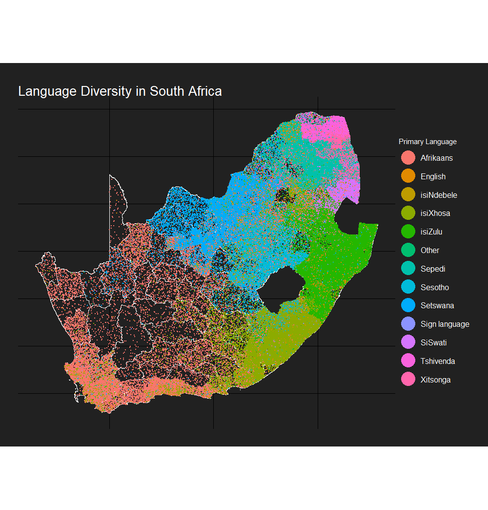

Recently, I'd seen two tweets with stunning examples of maps by Paul Campbell [here](https://twitter.com/PaulCampbell91/status/992043182996193280) and (taken inspiration from the first) by Imer Muhović [here](https://twitter.com/ImerM1/status/1037358973807210498).

The basic idea of the dot chloropleths is to visualise not only the location clustering of each variable but the number of observations (something traditional 'filled' chloropleths don't do). More importantly than this, the maps also just look really really cool.

I had a spare few minutes during work on Friday which I tidied up into a package to calculate the random position of dots for such maps which can be found [on my github](https://github.com/RobWHickman/sf.chlorodot).

Below, I'll outline the code for the South African example used in the package README. Data comes from Adrian Frith's [very good 2011 census site](https://census2011.adrianfrith.com/) and [gadm](https://gadm.org/download_country_v3.html) for the shapefiles.

```{r, libraries, warning=FALSE,message=FALSE}
library(sf)
library(ggplot2)
library(tidyverse)
library(data.table)
library(rvest)

devtools::install_github('RobWHickman/sf.chlorodot')
library(sf.chlordot)

```

Next, download and scrape the data for the map

```{r get_data, warning=FALSE,message=FALSE}
#download the South African shapefile fom gadm
admin_url <- "https://biogeo.ucdavis.edu/data/gadm3.6/Rsf/gadm36_ZAF_3_sf.rds"
download.file(admin_url, destfile = "shapefiles.rds", mode = "wb")
south_africa <- readRDS("shapefiles.rds") %>%
  #convert to sf
  st_as_sf() %>%
  select(region = NAME_3) %>%
  #merge geometries that have two rows
  group_by(region) %>%
  summarise()

#get the links to the data from Adrian Frith's site
sa_data_url <- "https://census2011.adrianfrith.com"
south_africa_data <- sa_data_url %>%
  read_html() %>% html_nodes(".namecell a") %>% html_attr("href") %>% paste0(sa_data_url, .) %>%
  lapply(., function(x) read_html(x) %>% html_nodes(".namecell a") %>% html_attr("href") %>% paste0(sa_data_url, .)) %>% unlist() %>%
   lapply(., function(x) read_html(x) %>% html_nodes(".namecell a") %>% html_attr("href") %>% paste0(sa_data_url, .)) %>% unlist()

#scrape the data on primary language from the 2011 South African census
language_data <- rbindlist(lapply(south_africa_data, function(x) {
  read <- read_html(x)
  language_nos <- read %>% html_nodes(".datacell") %>% html_text()
  start <- grep("Percentage", language_nos)[3] + 1
  stop <- grep("Population", language_nos) - 1
  #some areas have no data
  if(!is.na(start) & !is.na(stop)) {
    language_nos <- language_nos[start:stop]
    language_nos <- language_nos[seq(1, length(language_nos), 2)]
  } else {
    language_nos <- NA
  }
  
  languages <- read %>% html_nodes("tr > :nth-child(1)") %>% html_text()
  start <- grep("First language", languages) + 1
  stop <- grep("Name", languages) - 1
  if(length(start) > 0 & !is.na(stop)) {
    languages <- languages[start:stop]
  } else {
    languages <- NA
  }
  
  region_names <- read %>% html_nodes(".topname") %>% html_text()
  
  #combine into a df
  df <- data.frame(language = languages, primary_speakers = language_nos, region = region_names)
  return(df)
}))

```

the lanaguage data then needs to be transformed before the dot position is calculated. It must be in 'short' format with variables as column names. At the same time we can do some cleaning in order to match the shape areas with the region names from the census and remove data we don't want to plot

```{r transform_data, warning=FALSE,message=FALSE}
language_data %<>%
  #convert number of speakers to numeric
  mutate(primary_speakers = as.numeric(as.character(primary_speakers))) %>%
  #matching of area names with South African shapefile
  mutate(region = gsub(" NU", "", region)) %>%
  mutate(region = gsub("Tshwane", "City of Tshwane", region)) %>%
  #filter only the data we want to merge
  filter(region %in% south_africa$region) %>%
  filter(!is.na(language)) %>%
  filter(language != "Not applicable") %>%
  #spread the data
  dcast(., region ~ language, value.var = "primary_speakers", fun.aggregate = sum) %>%
  #join in the spatial geometry
  left_join(., south_africa) %>%
  #convert to sf
  st_as_sf()

```

then we can calculate the random dot position using calc_dots() from the sf.chlorodot package. This takes three arguments. The first is the df to take the data from (language_data). The second is which variables to calculate positions for. The easiest way to do this is to use names(df) and select from there, though a character vector can also be passed. Finally, n_per_dot is the number of observations (speakers of language x) for each dot on the map. This will affect the look of the map, but also the processing time (lower n_per_dot = greater time) so play around with it a bit.

```{r calc_dots, warning=FALSE,message=FALSE}
#calculate the dot positions using calc_dots from the sf.chlorodot package
sf_dots <- calc_dots(df = language_data, col_names = names(language_data)[2:14], n_per_dot = 1000)

```

Finally, we can plot the output of this

```{r, plot_sa, warning=FALSE,message=FALSE}
#stolen the background colour scheme from Paul Campbell's blog
#original inspiration for this package
p <- ggplot() +
  geom_sf(data = south_africa, fill = "transparent",colour = "white") +
  geom_point(data = sf_dots, aes(lon, lat, colour = variable), size = 0.1) +
  scale_colour_discrete(name = "Primary Language") +
  ggtitle("Language Diversity in South Africa") +
  theme_void() +
  guides(colour = guide_legend(override.aes = list(size = 10))) +
  theme(plot.background = element_rect(fill = "#212121", color = NA), 
        panel.background = element_rect(fill = "#212121", color = NA),
        legend.background = element_rect(fill = "#212121", color = NA),
        text =  element_text(color = "white"),
        title =  element_text(color = "white"),
        legend.text=element_text(size=12),
        plot.title = element_text(size = 20),
        plot.margin = margin(1, 1, 1, 1, "cm"))

```



Enjoy!